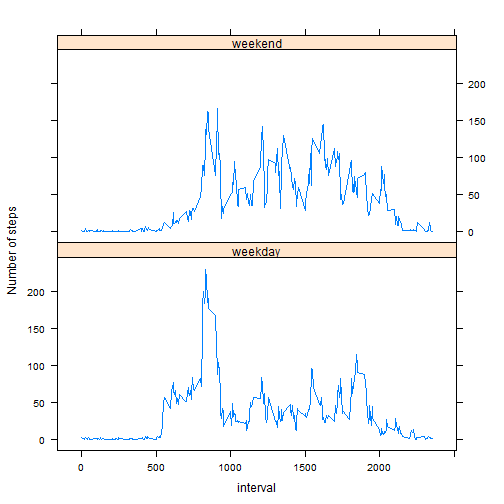

# Reproducible Research: Peer Assessment 1


## Loading and preprocessing the data


```r
    ac <- read.csv(unz('activity.zip', filename='activity.csv'),
                   colClasses = c("numeric", "Date", "numeric"))
    str(ac);
```

```
## 'data.frame':	17568 obs. of  3 variables:
##  $ steps   : num  NA NA NA NA NA NA NA NA NA NA ...
##  $ date    : Date, format: "2012-10-01" "2012-10-01" ...
##  $ interval: num  0 5 10 15 20 25 30 35 40 45 ...
```


## Mean total number of steps taken per day

```r
    require('lattice')

    x <- aggregate(steps ~ date, data=ac, FUN=sum)
    steps.mean <- mean(x$steps)
    steps.median <- median(x$steps)

    # histogram for total_steps
    histogram(~steps, data=x, nint=24, main="Activity",
              sub="Total steps each day",
              panel = function(...) {
                  panel.histogram(...);
                  panel.abline(v=steps.mean, col='red')
              }
              )
```

 

```r
    sprintf("Steps mean: %g", steps.mean)
```

```
## [1] "Steps mean: 10766.2"
```

```r
    sprintf("Steps median: %g", steps.median)
```

```
## [1] "Steps median: 10765"
```

## Average daily activity pattern


```r
    y <- aggregate(steps ~ interval, data=ac, FUN=mean)
    iid <- y$interval[which.max(y$steps)]

    xyplot(steps ~ interval, data=y, type='l', main="Activity",
           sub="Avarage steps/interval on a day",
           xlab='5-min interval',
           panel = function(...) {
               panel.xyplot(...)
               panel.abline(v=iid, col='red')
           })
```

 

```r
    sprintf("Interval for MAX: %d", iid)
```

```
## [1] "Interval for MAX: 835"
```

## Imputing missing values

1.  Missing values in dataset


```r
    # no of lines without NAs
    nrw <- nrow(ac)
    nok <- !complete.cases(ac)
    nas <- sum(nok)
    sprintf("Number of rows with NAs: %d/%d (%.4g%%)", nas, nrw,
            nas*100/nrw);
```

```
## [1] "Number of rows with NAs: 2304/17568 (13.11%)"
```


2. Filling values for NAs. Missing values for steps are filled with mean
across all days for that interval.


```r
    # remap intervals of a day to 1:288 range (288 == 24*60/5)
    hhmm2num <- function(hhmm) {
        hh = hhmm %/% 100
        mm = (hhmm %% 100) / 5
        return(1 + hh * 12 + mm)
    }

    ac2 <- ac

    # use vectorized if
    ac2$steps <- ifelse(is.na(ac2$steps),
                        round(y[hhmm2num(ac2$interval), "steps"]),
                        ac2$steps)
```

3. Histogram for total number of steps each day.


```r
    x2 <- aggregate(steps ~ date, data=ac2, FUN=sum)
    steps.mean <- mean(x2$steps)
    steps.median <- median(x2$steps)

    histogram(~steps, data=x2, nint=24, main="Activity",
              sub="Total steps each day",
              panel = function(...) {
                  panel.histogram(...);
                  panel.abline(v=steps.mean, col='red')
              }
              )
```

 

```r
    sprintf("Steps mean: %g", steps.mean)
```

```
## [1] "Steps mean: 10765.6"
```

```r
    sprintf("Steps median: %g", steps.median)
```

```
## [1] "Steps median: 10762"
```
    
## Activity patterns between weekdays and weekends


```r
    wd <- factor(weekdays(ac2$date) %in% c("Saturday", "Sunday"),
                      labels = c("weekday", "weekend"))
    ac2 <- cbind(ac2, wd)
    x2 <- aggregate(steps ~ interval + wd, data = ac2, FUN = mean)
    xyplot(steps ~ interval | wd, data=x2, type='l', layout=c(1,2),
           ylab="Number of steps")
```

 
